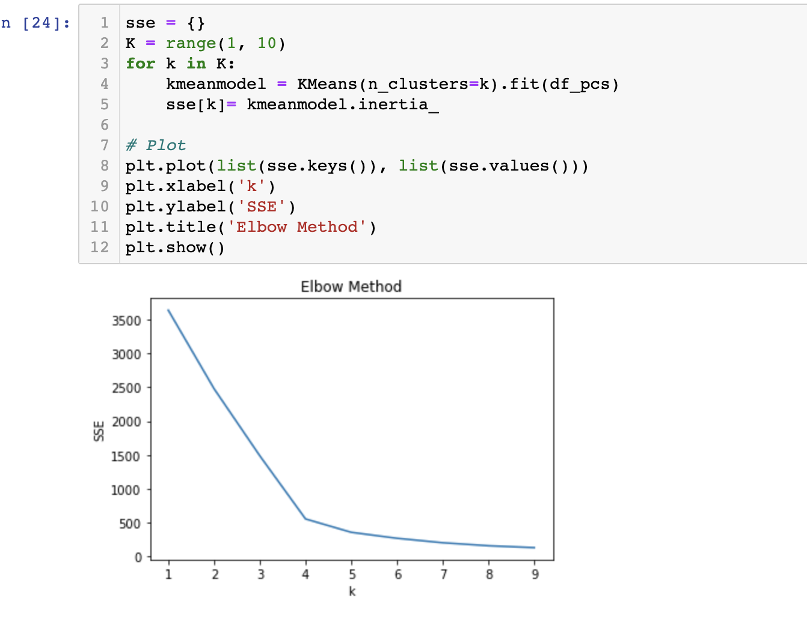
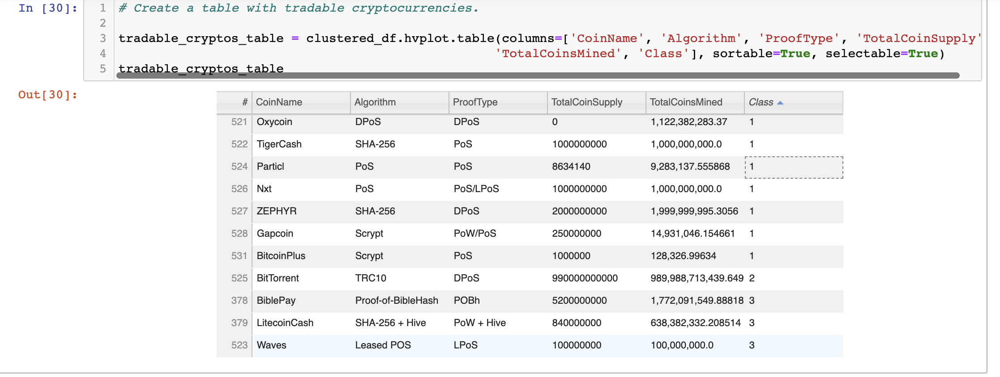
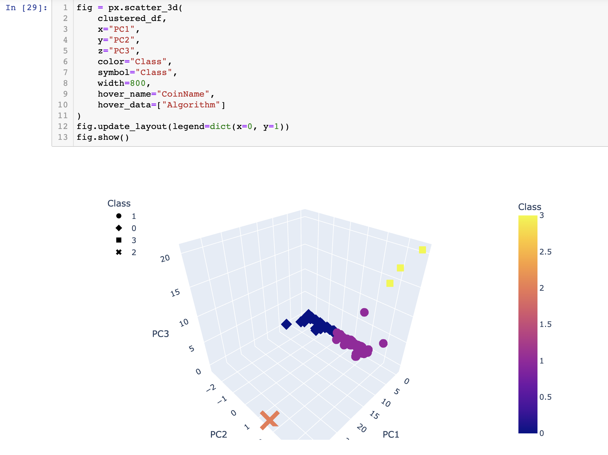
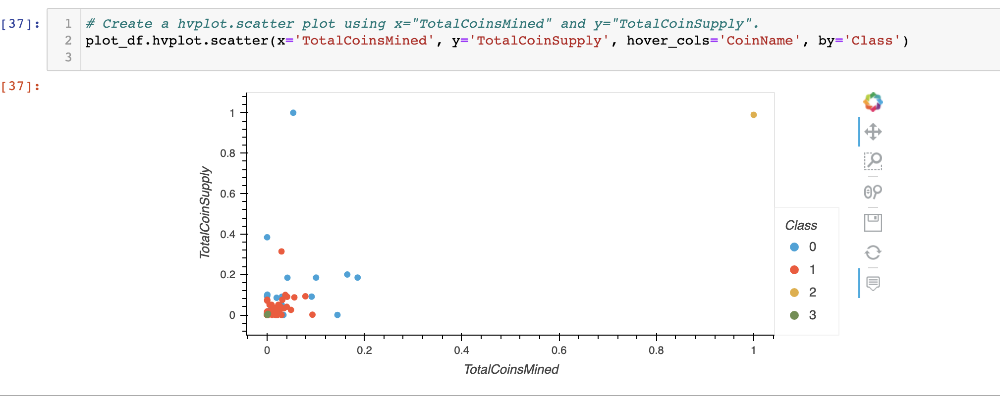

# Crytocurrencies
Unsupervised Machine Learning of Crytocurrencies 

## Analysis Overview 
In this project we are analyzing a database of cryptocurrencies using unsupervised machine learning to classify the data into groups according to their features. Once the data has been cleaned to only contain the currently traded cryptocurrencies, the data is sorted into a class based on our machine learning Model. This data was then used in a couple different visualiations to help display the data groups. This analysis can be used as a point of refernce for an investment bank to help determine possible cryptocurrencies that would be good for future investement. 

We use the following methods for our analysis:
- cleaned and preprocessed the database
- reduced the data dimension using Principal Component Analysis
- created cryptocurrency clusters using K-Means
- utilized visual classification results with 2D and 3D scatter plots

## Results 

## Summary 
